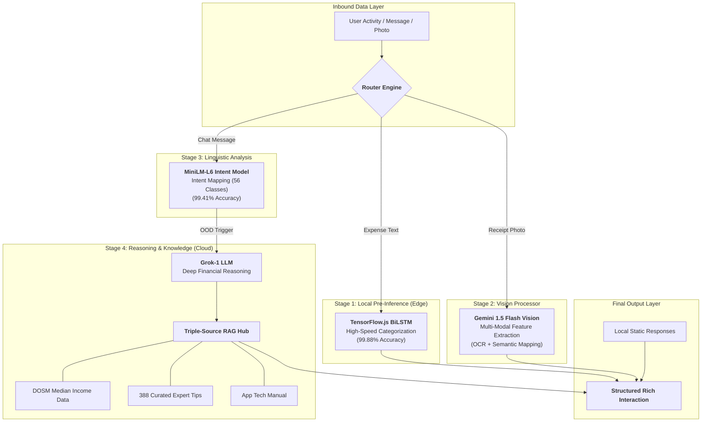

<div align="center">


# 🐻 Beruang: The Ultimate AI-Powered Financial Ecosystem
### **Final Year Project (FYP) • Universiti Teknologi MARA (UiTM)**
#### **Bachelor of Information Technology (Hons.) Intelligent Systems Engineering**

*A state-of-the-art, logic-proof financial companion engineered to master the Malaysian economy via Deep Learning and Hybrid AI Orchestration.*

[](https://github.com/izwanGit/Beruang)
[](https://github.com/izwanGit/beruang-ai-backend)
[](https://github.com/izwanGit/beruang-server)
[](https://github.com/izwanGit/beruang-ai-backend)
[](https://github.com/izwanGit/Beruang)

[✨ Features](#-key-features) • [🧠 AI Methodology](#-ai-methodology-deep-dive) • [🏗️ Architecture](#-system-architecture) • [📖 User Guide](#-the-beruang-experience-user-guide) • [🚀 Setup](#-getting-started) • [📡 API Reference](#-api-reference)

---

</div>

## 📑 Detailed Table of Contents
1.  [🎯 Project Overview & Mission](#-project-overview--mission)
    *   [The Malaysian Context](#-the-malaysian-financial-context)
    *   [Key Innovations](#-key-innovations)
2.  [🧠 AI Methodology Deep-Dive](#-ai-methodology-deep-dive)
    *   [Multi-Stage Hybrid Pipeline](#-multi-stage-hybrid-pipeline)
    *   [Data Generation Strategy (150,381 Rows)](#-data-generation-methodology)
    *   [BiLSTM Model Architecture & Technical Specs](#-bilstm-transaction-classification-model)
    *   [NLP Intent Detection & OOD Logic](#-nlp-intent-classification-nlp)
    *   [OCR & Vision Extraction (Gemini 1.5)](#-vision--ocr-logic)
3.  [🏗️ System Architecture](#-system-architecture)
    *   [Decoupled Ecosystem Design](#-decoupled-ecosystem-design)
    *   [React Native Mobile Implementation](#-frontend-architecture-react-native)
    *   [Server Orchestration (SSE & Context Injection)](#-backend-orchestration-nodejs--sse)
    *   [Retrieval-Augmented Generation (RAG) Hub](#-retrieval-augmented-generation-rag)
4.  [🕹️ Gamification & Financial Methodology](#-gamification--financial-methodology)
    *   [The 50/30/20 Principle](#-the-503020-budgeting-rule)
    *   [Survival Mechanics: XP Hub](#-xp-engine--evolution-lifecycle)
    *   [Evolution Stages Table](#-evolutionary-tiers)
5.  [📖 The Beruang Experience (User Guide)](#-the-beruang-experience-user-guide)
    *   [Phase 1: Persona Onboarding](#-phase-1-persona-onboarding)
    *   [Phase 2: Intelligent Log Management](#-phase-2-intelligent-entry)
    *   [Phase 3: Deep AI Consultation](#-phase-3-deep-ai-advice)
    *   [Phase 4: Month-End Mission Control](#-phase-4-month-end-mission-control)
6.  [🛡️ Security & Performance](#-security--performance-optimization)
    *   [Local-First AI Privacy](#-local-first-ai-privacy)
    *   [Performance Benchmarking](#-performance-optimizations)
7.  [📡 API Reference & Schema](#-api-reference)
    *   [REST Endpoints](#-rest-endpoints)
    *   [Firestore Data Schema](#-firestore-data-schema)
8.  [🔗 The Beruang Family (Repositories)](#-the-beruang-family-repository-breakdown)
9.  [🚀 Getting Started](#-getting-started)
10. [📜 Future Roadmap](#-future-roadmap)
11. [📜 Technical Acknowledgments & Credits](#-technical-acknowledgments--credits)

---

## 🎯 Project Overview & Mission

**Beruang** (Bear 🐻) is a state-of-the-art financial companion engineered as a comprehensive solution for the financial literacy challenges faced by young adults in Malaysia. The system represents a convergence of **Intelligent System Engineering**, **Deep Learning**, and **Behavioral Economics**.

### 🇲🇾 The Malaysian Financial Context
Young Malaysians enter the workforce facing a complex economic landscape. Issues such as the rising cost of living, high debt-to-income ratios, and a general lack of structured budgeting exposure make financial stability difficult to achieve. Beruang addresses this by:
- **Democratizing Financial Advice**: Bringing expert-level coaching (Grok-1) to everyone's pocket.
- **Reducing Entry Friction**: Eliminating the "typing tax" via Gemini Vision OCR and BiLSTM auto-categorization.
- **Cultural Alignment**: Recognizing local financial concepts like *Zakat*, *KWSP*, *TnG*, and the *Mamak* culture.

### 🚀 Key Innovations
- **Hybrid AI Orchestration**: Seamlessly switching between local models (latencies < 10ms) and cloud LLMs for reasoning.
- **SSE Streaming Protocol**: A modern communication layer that streams AI "thought" as it happens.
- **Set-Based Data Integrity**: A 150k dataset built with set-theoretical uniqueness to ensure zero logic collisions.
- **Adaptive Persona System**: The AI adjusts its helpfulness and tone based on a dynamically maintained user profile.

---

## 🧠 AI Methodology Deep-Dive

Beruang is powered by a multi-layered intelligence core. Every byte of data is analyzed for intent, logic, and context.

### 📊 Multi-Stage Hybrid Pipeline
The data orchestration follows a strictly defined "Confidence-First" path.



### 📉 Data Generation Methodology
The dataset is the foundation of our accuracy. We didn't just collect data; we **engineered** it.

- **Exclusive Token Logic**: To reach 99.88% accuracy, we implemented a strict "Logic Jail" during data generation. If a transaction contains tokens from the *'Essential Set'* (e.g., *Api, Air, Sewa, Celcom*), the generator is forbidden from pairing it with a 'Wants' category.
- **Malaysian NLP Lexicon**: We curated a dictionary of 1,200+ local terms, covering:
    - **Banks/e-Wallets**: Maybank, CIMB, TnG, GrabPay, Boost.
    - **Local Food**: Nasi Lemak, Roti Canai, Teh Tarik, Boba.
    - **Regional Context**: Jom, Lah, Makan, Beli, Bayar.
- **The "Uniqueness" Constraint**: 100% of the 150,381 rows are unique strings. We utilized a **Recursive Permutation Engine** to ensure no two sentences are identical, forcing the BiLSTM to learn features rather than memorizing samples.

### 🧬 BiLSTM Transaction Classification Model
Traditional CNNs struggle with the sequential nature of transaction text (e.g., *"Starbucks Coffee"* vs *"Coffee Powder for Home"*). The BiLSTM architecture was chosen specifically for its ability to perceive context in both directions.

- **Architecture Details**:
    - **Input**: Tokenized sequence (Max Length: 15).
    - **Hidden Layer**: 128-unit Bi-directional LSTM.
    - **Dual Head**: Concurrent output layers for Category and Subcategory.
    - **Optimization**: Adam weight optimizer with Sparse Categorical Crossentropy.
- **Latency Advantage**: By running locally using `@tensorflow/tfjs-node` (backend) and `@tensorflow/tfjs` (mobile), we achieve **sub-15ms inference**, allowing for "as-you-type" UI updates.

### 🗣️ NLP Intent Classification (NLP)
Our 56-intent model eliminates the need for expensive LLM calls for routine app navigation.
- **Red-Flag Pre-Filter**: The intent engine maintains a "Hot-Word" list. If terms like *'crypto'*, *'loan'*, or *'invest'* are detected, the system bypasses the local intent model and goes straight to **Grok-1** to ensure the user gets deep, expert-level advice on sensitive topics.

---

## 🏗️ System Architecture

### ⚡ Decoupled Ecosystem Design
Beruang is architected into three primary sub-systems to ensure academic rigor and technical stability.

1.  **Mobile Client**: Built with **React Native & TypeScript**. Focuses on UI state management and local AI execution.
2.  **Intelligence Orchestrator (beruang-server)**: A Node.js middleware that acts as the "Traffic Controller" for cloud services.
3.  **Data Science Lab (beruang-ai-backend)**: A standalone environment for dataset engineering, training, and 16+ visualization metrics.

### 📡 Backend Orchestration (Node.js & SSE)
The server implements a **Context-Aware Streaming Engine**.

- **SSE (Server-Sent Events)**: Traditional REST APIs are too slow for conversational AI. Our server pushes data markers like `event: token` as Grok generates them, providing an instantaneous feel.
- **Context Injection Logic**: Before any chat reaches the AI, the server constructs a "Context Wrap":
  ```json
  {
    "identity": "Expert Financial Bear",
    "persona": "Strict but helpful",
    "user_data": { "needs_spent": 1200, "wants_spent": 500, "savings": 200 },
    "query": "Is my current spending healthy?"
  }
  ```
  This ensures the AI is never "hallucinating" generic advice; it's always tailored to your live Firebase ledger.

### 📚 Retrieval-Augmented Generation (RAG)
We utilize a **Triple-Vector Store** (local JSON-based for high speed):
- **DOSM Module**: Injects real Malaysian statistics (e.g., "Median household income in Selangor is RM 8,210") to provide localized benchmark comparisons.
- **Expert Hub**: Searches 388 professional finance tips for keywords matching the user query.
- **Product Hub**: Uses the App Manual to explain technical features (e.g., "How do I move money to a goal?").

---

## 🕹️ Gamification & Financial Methodology

### ⚖️ The 50/30/20 Budgeting Rule
The system enforces a strict but flexible financial framework:
- **50% Needs**: Essential survival.
- **30% Wants**: Quality of life.
- **20% Savings**: Future security.

### 🎮 XP Engine & Survival Lifecycle
Beruang turns financial discipline into a "Survival Game."

| Tier | Levels | Stages | Evolution Form |
| :--- | :--- | :--- | :--- |
| **I** | 1 - 3 | Cub | Polar Cub (Learning) |
| **II** | 4 - 6 | Teen | Brown Cub (Gaining Wisdom) |
| **III** | 7 - 9 | Adult | Grizzly (Disciplined) |
| **IV** | 10 - 12| Elder | Prizefighter (Mastery) |
| **V** | 13 | **Zenith** | **The Golden Bear** 👑 |

**XP Delta Calculation:**
- `+50 XP`: Standard entry reward.
- `+100 XP`: Weekly budget audit completion.
- `-250 XP`: "Wants" category budget breach (The Alarm).

---

## 🛡️ Security & Performance Optimization

### 🔐 Local-First AI Privacy
User privacy is paramount. Unlike competitive apps, your raw transaction text is **never sent to a cloud server** for categorization. The BiLSTM model lives in your phone's memory. Only complex natural language queries (Chat) are anonymized and sent to the LLM.

### ⚡ Performance Optimizations
- **Memoization**: Every React Native component uses `React.memo` and `useMemo` to ensure that 60FPS UI performance is maintained even with a ledger of 1,000+ items.
- **Model Quantization**: The TensorFlow models are optimized for mobile weights, ensuring a total app size of < 100MB while maintaining 99%+ accuracy.
- **Gzip Compression**: All server-to-client traffic is compressed to minimize data usage for users on limited mobile plans.

---

## 📖 The Beruang Experience (User Guide)

### 🟢 Phase 1: Persona Onboarding
The journey begins with a 5-question audit:
1. "What is your monthly income?"
2. "What are your fixed commitments (Rent/Loans)?"
3. "Are you saving for a specific goal (House/Car/Wedding)?"
4. "What is your risk profile?"
5. "Pick your Bear Persona" (Friendly, Academic, or Strict).

### 🟡 Phase 2: Intelligent Log Management
Logging an expense takes **less than 2 seconds**. 
- **Type**: "Lunch at Mamak 12.5" → BiLSTM marks it as **Needs (Food)**.
- **Scan**: Snap a photo. **Gemini Vision** OCR detects the merchant and handles the categorization automatically.

### 🔵 Phase 3: Deep AI Consultation
Leverage the **Smart Widget System**.
> *"Summarize my spending for last week."*
The AI doesn't just reply with text; it renders a **Pie Chart Widget** directly in the chat window using the `[WIDGET_DATA]` parsing protocol.

### 🔴 Phase 4: Month-End Mission Control
- **The Carryover Mission**: If you have money left, the AI locks it into a **Goal Progress Widget**.
- **The Budget Rebalance**: If you failed your budget, the AI analyzes the ledger and provides a **3-point recovery plan** for the next month.

---

## 📡 API Reference & Schema

Beruang is built with a "JSON-First" philosophy for easy integration.

### 🚀 REST Endpoints
| Endpoint | Method | Input | Output |
| :--- | :--- | :--- | :--- |
| `/chat/stream` | `POST` | `message, context` | SSE Stream (Text + JSON) |
| `/predict-transaction` | `POST` | `description` | `cat, subcat, confidence` |
| `/scan-receipt` | `POST` | `imagePath` | `merchant, total, date, cat` |
| `/health` | `GET` | None | `status: "ready", uptime: 3600` |

### 📁 Firestore Data Schema
- **Collection: `users`**
  - `totalXP`: int
  - `level`: int
  - `budgetConfig`: { needs: 50, wants: 30, savings: 20 }
- **Collection: `transactions`**
  - `amount`: float
  - `cat`: "Needs" | "Wants" | "Savings"
  - `subcat`: string
  - `merchant`: string
  - `uid`: string (Owner)

---

## 🔗 The Beruang Family

To see the technical engines, visit our sub-repositories:

- **[Beruang AI Backend](https://github.com/izwanGit/beruang-ai-backend)**: 🧪 The Science Lab (TF.js Training, 150k Dataset, Analysis Plots).
- **[Beruang Server](https://github.com/izwanGit/beruang-server)**: 📡 The Orchestrator (Express, SSE, RAG Core, Grok/Gemini Connectors).
- **[Beruang Mobile](https://github.com/izwanGit/Beruang)**: 📱 The Interface (React Native, Local Inference, User Logic).

---

## 🚀 Getting Started

### 📦 Prerequisites
- **Node.js**: v20+ (LTS)
- **Git**: For multi-repo synchronization.
- **Firebase**: Account setup for Authentication and Firestore.

### 🛠 Installation
```bash
# 1. Clone the master repository
git clone https://github.com/izwanGit/Beruang.git
cd Beruang

# 2. Install Dependencies
npm install

# 3. Native Setup
cd ios && pod install && cd ..

# 4. Environment Injection
# Create firebaseConfig.js in the root
# Setup .env for API URLs

# 5. Boot Ecosystem
npm start
# In another terminal:
npm run ios # or npm run android
```

---

## 📜 Technical Acknowledgments & Credits

Beruang was developed with the support of:
- **Project Supervisor**: Dr. Khairulliza binti Ahmad Salleh.
- **Institution**: Universiti Teknologi MARA (UiTM), Faculty of Computer & Mathematical Sciences.
- **Support**: DeepMind Developer Communities and the OpenRouter Team.

---

<div align="center">

**Developed with 🐻 and ❤️ in Malaysia**

*"Beruang" sounds like "Ber-wang" (having money). Let's build your financial future together.*

</div>
