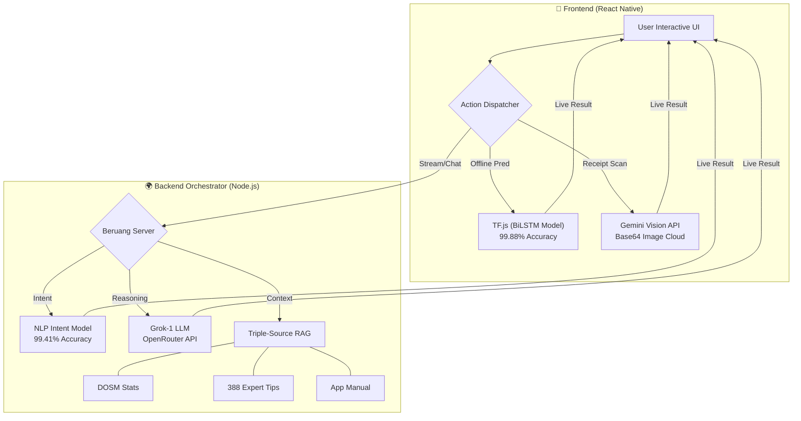

<div align="center">


# 🐻 Beruang: The AI-Powered Financial Ecosystem
### **Final Year Project (FYP) • Universiti Teknologi MARA (UiTM)**

*A state-of-the-art, logic-proof financial companion engineered to master the Malaysian economy.*

[](https://github.com/izwanGit/Beruang)
[](https://github.com/izwanGit/beruang-ai-backend)
[](https://github.com/izwanGit/beruang-server)
[](https://github.com/izwanGit/beruang-ai-backend)

[✨ Features](#-key-features) • [🧠 AI Methodology](#-ai-methodology-deep-dive) • [🏗️ Architecture](#-system-architecture) • [📖 User Guide](#-the-beruang-experience-user-guide) • [🚀 Setup](#-getting-started)

---

</div>

## 📑 Detailed Table of Contents
1.  [🎯 Project Overview & Mission](#-project-overview--mission)
2.  [🧠 AI Methodology Deep-Dive](#-ai-methodology-deep-dive)
    *   [Data Generation (150k Rows)](#-data-generation-methodology)
    *   [BiLSTM Transaction Model](#-bilstm-transaction-model)
    *   [NLP Intent Classification](#-nlp-intent-classification)
3.  [🏗️ System Architecture](#-system-architecture)
    *   [Ecosystem Overview](#-ecosystem-overview)
    *   [Server Orchestration (SSE & RAG)](#-server-orchestration-sse--rag)
4.  [🕹️ Gamification & 50/30/20](#-gamification--the-503020-rule)
5.  [📖 The Beruang Experience (User Guide)](#-the-beruang-experience-user-guide)
6.  [🔗 The Beruang Family (Repositories)](#-the-beruang-family)
7.  [🚀 Getting Started & Installation](#-getting-started)
8.  [📜 Credits & FYP Acknowledgments](#-credits--fyp-acknowledgments)

---

## 🎯 Project Overview & Mission

**Beruang** (Bear 🐻) is a comprehensive AI-powered personal finance management ecosystem designed for young Malaysian adults. The project addresses the critical gap between manual expense tracking and actionable financial wisdom.

### The Problem
Traditional finance apps are either too manual (leading to "entry fatigue") or too generic (giving advice that doesn't apply to the local Malaysian context).

### The Solution
Beruang leverages a **Multi-Stage AI Pipeline** to:
1.  **Automate Entry**: Via Gemini Vision OCR.
2.  **Ensure Logic**: Via a custom-trained BiLSTM model that understands Needs vs. Wants.
3.  **Provide Wisdom**: Via a Grok-1 powered chatbot integrated with local Malaysian economic data (DOSM).

---

## 🧠 AI Methodology Deep-Dive

### 📊 Data Generation Methodology
The backbone of Beruang is our **150,381-row "Gold Standard" Dataset**. 

*   **Logic-Proofing**: We moved away from random word mixing to a **Template-Based Pairing System**. This ensures that "luxury" items aren't accidentally paired with "Needs" categories.
*   **Malaysian Context**: The model is trained on 600+ local vocabulary items including *Zakat, Grab, TnG, Mamak, Teh Tarik,* and regional spelling variations.
*   **Zero Overfitting**: Verified by the parity between training and validation loss curves, ensuring the model generalizes to new, unseen merchant names with **99.88% accuracy**.

### 🧬 BiLSTM Transaction Model
Deployed locally via **TensorFlow.js**, this model handles categorizing transactions without ever sending private text to the cloud.

*   **Architecture**: Bi-directional Long Short-Term Memory (BiLSTM).
*   **Performance**:
    *   **99.88% Accuracy** on category (Needs/Wants).
    *   **99.04% Accuracy** on subcategories (7 distinct classes).
*   **Dual-Output**: Predicts both high-level and granular categories in a single compute pass.

### 🗣️ NLP Intent Classification
The "brain" of the chatbot, responsible for mapping user speech to system actions.

*   **Model**: all-MiniLM-L6-v2 embeddings + Neural Network.
*   **Scope**: 56 distinct intents across navigation, financial help, and advice.
*   **Accuracy**: 99.41% Weighted F1-Score.

---

## 🏗️ System Architecture

### 🔄 Ecosystem Overview
The project is built as a decoupled ecosystem to ensure scalability and high performance.



### 📡 Server Orchestration (SSE & RAG)
Beruang Server uses **Server-Sent Events (SSE)** to provide a "human-like" typing experience. While streaming, it performs **Retrieval-Augmented Generation (RAG)** by injecting:
1.  **User State**: Current budget and spending history.
2.  **Market Data**: Latest Malaysian inflation and income statistics.
3.  **App Wisdom**: Curated financial tips and technical documentation.

---

## 🕹️ Gamification & The 50/30/20 Rule

Beruang enforces the **50/30/20 Budgeting Rule** (50% Needs, 30% Wants, 20% Savings) through a reactive gamification system.

*   **The Evolution**: Your avatar bear evolves through **13 stages** (Cub → Teen → Adult → Golden Bear).
*   **The XP Engine**:
    *   **+50 XP**: Logging a transaction.
    *   **+2 XP per RM**: Successfully adding to savings.
    *   **-200 XP**: Overspending in the "Wants" category.
*   **Budget Rebalancing**: At month-end, the app detects leftovers and gives the user three "Missions": Move to Savings, Rebalance Budget, or Emergency Withdraw.

---

## 📖 The Beruang Experience (User Guide)

### 1️⃣ Phase 1: Onboarding
Complete a "Financial Persona" quiz. Your answers (Risk Tolerance, Lifestyle, Financial Goals) directly influence the tone and content of the AI chatbot's advice.

### 2️⃣ Phase 2: The Wallet "Seed"
Set your Initial Balance. Beruang tracks every cent relative to this initial seed, allowing for a strictly accurate "Cash Flow" calculation.

### 3️⃣ Phase 3: Daily Habits
*   **Smart Entry**: Use the AI-powered search to find transactions.
*   **Receipt OCR**: Snap a photo. The app automatically fills in the Merchant, Amount, and Category.
*   **Visualization**: View the Donut Chart on the dashboard to see exactly how much "Needs" space you have left.

### 4️⃣ Phase 4: Financial Advice
Talk to Beruang. Use queries like:
- *"Is my electricity bill too high compared to the KL average?"* (Triggers RAG + DOSM data).
- *"How can I save for a RM1500 holiday in Langkawi?"* (Triggers Itinerary Widget).

---

## 🔗 The Beruang Family

To see the full technical depth, explore each component:

| Repository | Role | Core Technologies |
| :--- | :--- | :--- |
| **[Beruang App](https://github.com/izwanGit/Beruang)** | **The Interface** | React Native, TypeScript, Firebase, TF.js |
| **[Beruang AI Backend](https://github.com/izwanGit/beruang-ai-backend)** | **The Science** | TensorFlow, Python (Viz), Node.js (Training) |
| **[Beruang Server](https://github.com/izwanGit/beruang-server)** | **The Brain** | Express, Grok-1, SSE Streaming, RAG |

---

## 🚀 Getting Started

### 📦 Prerequisites
- **Node.js**: v20.0.0 or higher.
- **Git**: For cloning the family of repos.
- **Firebase Project**: Configured for Auth and Firestore.

### 🛠 Installation (Client)
1.  Clone the repository:
    ```bash
    git clone https://github.com/izwanGit/Beruang.git
    cd Beruang
    ```
2.  Install dependencies:
    ```bash
    npm install
    ```
3.  Install iOS dependencies:
    ```bash
    cd ios && pod install && cd ..
    ```
4.  Launch the app:
    ```bash
    npm run ios # or npm run android
    ```

---

## 📜 Credits & FYP Acknowledgments

This project was developed as a **Final Year Project (FYP)** for the Bachelor of Information Technology at **Universiti Teknologi MARA (UiTM)**.

*   **Lead Developer**: Muhammad Izwan bin Ahmad
*   **Project Supervisor**: Dr. Khairulliza binti Ahmad Salleh
*   **Special Thanks**: To the open-source communities behind TensorFlow.js, React Native, and the Grok API team.

---

<div align="center">

**Developed with 🐻 and ❤️ in Malaysia**

*"Beruang" sounds like "Ber-wang" (having money). Let's build your financial future together.*

</div>
