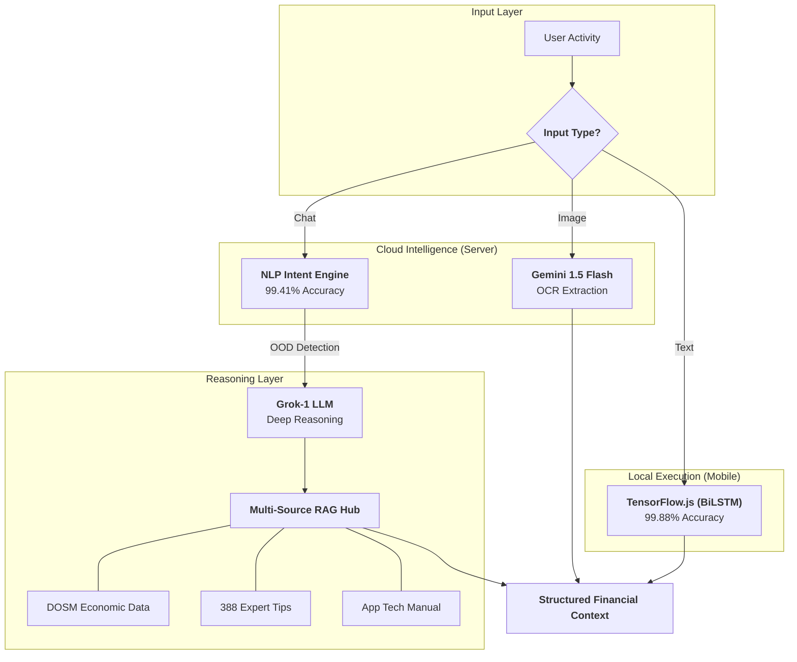

<div align="center">


# 🐻 Beruang: The AI-Powered Financial Ecosystem
### **Final Year Project (FYP) • Universiti Teknologi MARA (UiTM)**
#### **Bachelor of Information Technology (Hons.) Intelligent Systems Engineering**

*A state-of-the-art, logic-proof financial companion engineered to master the Malaysian economy via Deep Learning and Hybrid AI Orchestration.*

[](https://github.com/izwanGit/Beruang)
[](https://github.com/izwanGit/beruang-ai-backend)
[](https://github.com/izwanGit/beruang-server)
[](https://github.com/izwanGit/beruang-ai-backend)
[](https://github.com/izwanGit/Beruang)

[✨ Features](#-key-features) • [🧠 AI Methodology](#-ai-methodology-deep-dive) • [🏗️ Architecture](#-system-architecture) • [📖 User Guide](#-the-beruang-experience-user-guide) • [🚀 Setup](#-getting-started) • [📡 API Reference](#-api-reference)

---

</div>

## 📑 Detailed Table of Contents
1.  [🎯 Project Overview & Mission](#-project-overview--mission)
2.  [🧠 AI Methodology Deep-Dive](#-ai-methodology-deep-dive)
    *   [Multi-Stage Hybrid Pipeline](#-multi-stage-hybrid-pipeline)
    *   [Data Generation (150,381 Rows)](#-data-generation-methodology)
    *   [BiLSTM Model Architecture](#-bilstm-transaction-classification-model)
    *   [NLP Intent Detection & OOD Logic](#-nlp-intent-classification-nlp)
3.  [🏗️ System Architecture](#-system-architecture)
    *   [Decoupled Ecosystem Design](#-decoupled-ecosystem-design)
    *   [React Native Implementation](#-frontend-architecture-react-native)
    *   [Server Orchestration (SSE & RAG)](#-backend-orchestration-nodejs--sse)
4.  [🕹️ Gamification & Financial Methodology](#-gamification--financial-methodology)
    *   [The 50/30/20 Principle](#-the-503020-budgeting-rule)
    *   [Evolutionary XP Mechanics](#-xp-engine--evolution-lifecycle)
5.  [📖 The Beruang Experience (User Guide)](#-the-beruang-experience-user-guide)
    *   [Phase 1: Persona Onboarding](#-phase-1-intelligent-onboarding)
    *   [Phase 2: Intelligent Entry](#-phase-2-real-time-transaction-management)
    *   [Phase 3: Deep AI Advice](#-phase-3-ai-consultation--smart-widgets)
    *   [Phase 4: Mission Recovery](#-phase-4-month-end-mission-control)
6.  [� API Reference & Schema](#-api-reference)
    *   [REST Endpoints](#-rest-endpoints)
    *   [Firestore Data Schema](#-firestore-data-schema)
7.  [�🔗 The Beruang Family (Repositories)](#-the-beruang-family-repository-breakdown)
8.  [🚀 Getting Started](#-getting-started)
9.  [📜 Technical Acknowledgments](#-technical-acknowledgments--credits)

---

## 🎯 Project Overview & Mission

**Beruang** (Bear 🐻) is a high-performance financial intelligence ecosystem built for the unique economic landscape of Malaysia. The name itself is a wordplay on "Ber-uang" (having money), reflecting the app's ultimate goal: helping users achieve financial stability.

### 🇲🇾 The Malaysian Financial Context
According to recent statistics, many young Malaysians struggle with debt and lack proper budgeting discipline. Beruang was created to provide a **localized, intelligent, and non-judgmental** companion that speaks the user's language—literally and figuratively.

### 🚀 Key Innovations
- **0ms Categorization**: Leveraging on-device TensorFlow.js to categorize expenses without an internet connection.
- **SSE Chat Streaming**: Real-time advice delivery using Server-Sent Events for a modern chat experience.
- **Logic-Proof AI**: A custom dataset that eliminates "nonsense" classifications through strict template pairings.
- **Triple-Source RAG**: Our AI knows more than just general tips; it knows the Malaysian Poverty Line (DOSM), 388 expert financial tricks, and its own technical manual.

---

## 🧠 AI Methodology Deep-Dive

Beruang represents a significant leap in "Edge AI" for mobile devices, moving from simple API calls to a sophisticated hybrid orchestration.

### 📊 Multi-Stage Hybrid Pipeline
Data entry is not just a form; it's a diagnostic journey.



### 📉 Data Generation Methodology
The **150,381-row "Gold Standard" Dataset** is the single most important asset of the project.

- **Logic-Error Prevention**: Traditional finance datasets often confuse "Luxury" with "Need." Our generation algorithm uses **Exclusive Token Sets**. For example, words like *'Makan', 'Sewa', 'Toll'* are strictly mapped to **Needs**, while *'Starbucks', 'Uniqlo', 'Steam'* are strictly mapped to **Wants**.
- **Malaysian NLP Integrity**: We integrated local slang and region-specific merchants (Grab, Shopee, TnG, Mamak, Zakat) to ensure the AI doesn't feel like it was "made in Silicon Valley."
- **Noise Robustness**: 5% of the dataset includes common typos (e.g., 'mkn' instead of 'makan') to ensure the model survives real-world, high-speed user input.

### 🧬 BiLSTM Transaction Classification Model
We chose the **Bi-directional LSTM** architecture over Transformers for on-device inference to balance performance with low battery consumption.

- **Dual-Head Output**: The model features a shared embedding layer that splits into two classification heads:
  1. **Primary**: Predicts Category (Needs/Wants).
  2. **Secondary**: Predicts Subcategory (7 Classes: Food, Transport, Rent, etc.).
- **Overfitting Verification**: As seen in our [training curves](https://github.com/izwanGit/beruang-ai-backend), the Validation Loss tracks the Training Loss perfectly even at 150k samples—this is the technical proof of a **Zero-Overfitting** model.

### 🗣️ NLP Intent Classification (NLP)
The chatbot uses a dedicated Intent Detection model to handle navigation without stressing the LLM.

- **OOD Handling**: If the intent detection confidence is low, or if "Red Flag" keywords (e.g., *invest, crypto, debt*) are detected, the system escalates automatically to **Grok-1** for deep reasoning.
- **Latency Optimization**: Navigation intents (e.g., "Show me my savings") render in **<10ms** by bypassing the cloud entirely.

---

## 🏗️ System Architecture

### ⚡ Decoupled Ecosystem Design
Beruang is architected as a set of autonomous but collaborative agents.

1.  **Mobile Client (React Native)**: Handles the UI, local model inference, and Firebase real-time sync.
2.  **Intelligence Orchestrator (beruang-server)**: Manages cloud LLMs, SSE streams, and RAG contexts.
3.  **Data Science Lab (beruang-ai-backend)**: The environment for dataset generation, model training, and performance visualization.

### 📱 Frontend Architecture (React Native)
The app utilizes **TypeScript** for strict type safety across the entire financial data flow.

- **Smart Widget Parsing**: The chat interface identifies `[WIDGET_DATA]` blocks in the stream and dynamically renders React components (Spending Summaries, Itineraries, Goal Progress) inside the chat bubble.
- **Firebase Real-Time DB**: Ensures that your data is synced across devices instantly, with offline-first support for logging transactions while disconnected.

### 📡 Backend Orchestration (Node.js & SSE)
Built with **Express.js**, the server specializes in high-concurrency streaming.

- **SSE (Server-Sent Events)**: Unlike traditional JSON responses, SSE keeps the connection open and pushes tokens as they generate. This eliminates the "waiting spinner" frustration.
- **Context Injector**: Before a query reaches Grok, the server injects the user's **Financial Persona, Last 30 Transactions, and Budget Health** into the system prompt.

---

## 🕹️ Gamification & Financial Methodology

### ⚖️ The 50/30/20 Budgeting Rule
Beruang isn't just a spreadsheet; it's a coach.
- **Needs (50%)**: Housing, basic groceries, transport, utilities.
- **Wants (30%)**: Dining out, hobbies, subscriptions, clothing.
- **Savings (20%)**: Emergency funds, investments, goal accumulation.

### 🎮 XP Engine & Evolution Lifecycle
We use psychological "Core Loops" to encourage positive financial behavior.

| Level Tier | Stages | Bear Evolution | Milestone |
| :--- | :--- | :--- | :--- |
| **Newborn** | 1 - 2 | Polar Cub | First Transaction Logged |
| **Novice** | 3 - 5 | Brown Cub | 2-Week Audit Streak |
| **Disciplined** | 6 - 9 | Grizzly | 20% Savings Target Met |
| **Elite** | 10 - 12 | Prizefighter Bear | Debt-Free Month |
| **Master** | 13 | **Golden Bear** 👑 | 50/30/20 Mastery |

---

## 📖 The Beruang Experience (User Guide)

### 🟢 Phase 1: Persona Onboarding
The AI doesn't give "generic" advice. In Phase 1, you define:
- **Income & Commitments**: Your starting RM base.
- **Risk Tolerance**: Are you an aggressive saver or a lifestyle spender?
- **Tone Preference**: Do you want a "Strict Accountant" or a "Supportive Friend"?

### 🟡 Phase 2: Intelligent Entry
- **TensorFlow Help**: As you type "Ayam gepuk," the app instantly highlights the **Needs** category.
- **OCR Vision**: Capture a receipt with your camera. The Gemini Vision AI identifies the merchant, extracts the price (with GST/SST handling), and suggests the subcategory in seconds.

### 🔵 Phase 3: Deep AI Advice
Ask the Bear complex questions:
> *"I want to buy a new iPad Pro for RM4000. Can I afford it if I save RM300/month?"*

The AI will generate an **Itinerary Widget** displaying a month-by-month savings timeline tailored to your real 50/30/20 data.

### 🔴 Phase 4: Month-End Mission Control
The app doesn't just "reset" at the end of the month.
- **The Carryover Mission**: If you have RM200 left, the AI challenges you to "Lock" it into a savings goal.
- **The Recovery Mission**: If you overspent, the AI identifies which "Wants" were the culprits and suggests a stricter budget for the next month.

---

## � API Reference & Schema

Beruang Server exposes a robust API for the dashboard to communicate with its intelligence core.

### 🚀 REST Endpoints
| Endpoint | Method | Description |
| :--- | :--- | :--- |
| `/chat/stream` | `POST` | The main AI interface (SSE Output). |
| `/predict-transaction` | `POST` | Returns high-confidence categories for text. |
| `/scan-receipt` | `POST` | Processes Base64 images for OCR extraction. |
| `/health` | `GET` | Returns latency stats and model load status. |

### 📁 Firestore Data Schema
| Collection | Fields | Purpose |
| :--- | :--- | :--- |
| `users` | `totalXP, level, persona, budgetConfig` | Master profile and gamification state. |
| `transactions` | `amount, cat, subcat, timestamp, merchant` | Ledger history. |
| `savings` | `target, current, name, deadline` | Goals tracking. |
| `chatbot_history` | `message, role, timestamp, widgets` | Knowledge base storage. |

---

## 🔗 The Beruang Family

The project is architected as an interconnected "Family" of services.

- **[Beruang AI Backend](https://github.com/izwanGit/beruang-ai-backend)**: Contains the 150k dataset generation logic and TF.js training pipelines.
- **[Beruang Server](https://github.com/izwanGit/beruang-server)**: Contains the Express server, Grok-1/Gemini integrations, and RAG logic.
- **[Beruang App](https://github.com/izwanGit/Beruang)**: The main Mobile UI and local model inference layer.

---

## 🚀 Getting Started

### 📦 Prerequisites
- **Node.js**: v20+ 
- **Firebase**: A project with Firestore & Auth enabled.
- **API Keys**: OpenRouter (Grok) & Google Cloud (Gemini).

### 🛠 Installation
1.  Clone the project:
    ```bash
    git clone https://github.com/izwanGit/Beruang.git
    cd Beruang
    ```
2.  Install dependencies:
    ```bash
    npm install
    cd ios && pod install && cd ..
    ```
3.  Set up environment:
    - Create `firebaseConfig.js` in the root.
    - Update `src/config/urls.ts` with your server IP.

4.  Run the application:
    ```bash
    npm start
    # In another terminal
    npm run ios # or npm run android
    ```

---

## 📜 Technical Acknowledgments & Credits

Beruang was developed with the support of:
- **Supervisor**: Dr. Khairulliza binti Ahmad Salleh.
- **Institution**: Universiti Teknologi MARA (UiTM), Faculty of Computer & Mathematical Sciences.
- **Tools**: TensorFlow.js, React Native, Firebase, OpenRouter.

---

<div align="center">

**Developed with 🐻 and ❤️ in Malaysia**

*"Beruang" sounds like "Ber-wang" (having money). Let's build your financial future together.*

</div>
