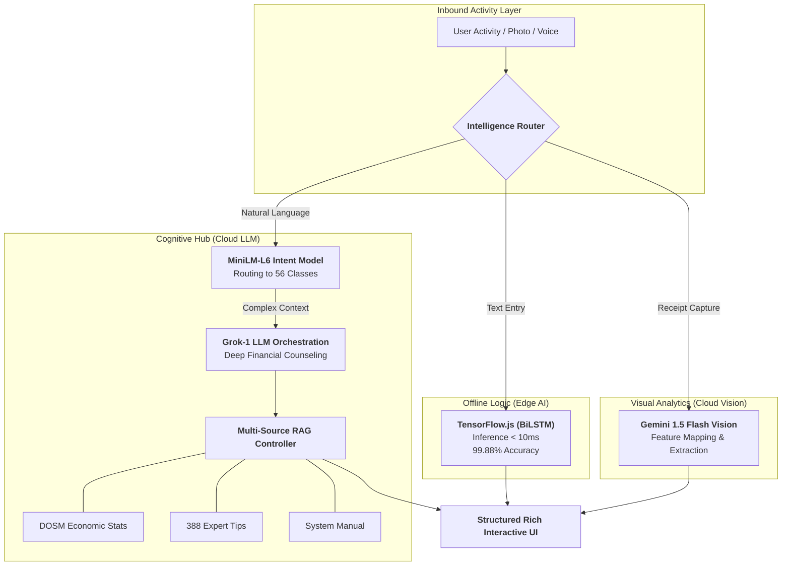
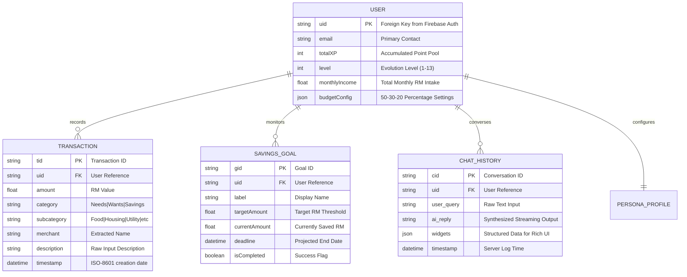

<div align="center">


# 🐻 Beruang: The Ultimate AI-Powered Financial Ecosystem
### **Comprehensive Technical Report & Master Documentation Hub**  
**Final Year Project (FYP) • Universiti Teknologi MARA (UiTM)**  
**Bachelor of Information Technology (Hons.) Intelligent Systems Engineering**

*A state-of-the-art, logic-proof financial companion engineered to master the Malaysian economy through Hybrid AI Orchestration, Sequential Deep Learning (BiLSTM), and Behavioral Economics.*

[](https://github.com/izwanGit/Beruang)
[](https://github.com/izwanGit/beruang-ai-backend)
[](https://github.com/izwanGit/beruang-server)
[](https://github.com/izwanGit/beruang-ai-backend)
[](https://github.com/izwanGit/Beruang)

[✨ Core Features](#-key-features) • [🧠 AI Methodology](#-2-ai-methodology-deep-dive) • [🏗️ Architecture](#-3-system-architecture) • [📊 ERD & Data](#-4-entity-relationship-diagram-erd) • [📖 User Guide](#-7-the-beruang-experience-user-guide) • [🚀 Getting Started](#-14-getting-started)

---

</div>

## 📑 1. Comprehensive Table of Contents (Full System Report)

1.  [🎯 **Project Overview & Strategic Mission**](#-1-project-overview--mission)
    *   [1.1 Problem Statement: The Tracking Tragedy](#11-problem-statement)
    *   [1.2 The Malaysian Socio-Economic Context & Need Analysis](#12-the-malaysian-socio-economic-context)
    *   [1.3 Core Innovations & Competitive Advantage](#13-core-innovations--flex)
    *   [1.4 Project Goals & Success Metrics Framework](#14-project-goals--success-metrics)
2.  [🧠 **AI Methodology: The Intelligence Layer**](#-2-ai-methodology-deep-dive)
    *   [2.1 Hybrid Pipeline Architecture: Edge vs. Cloud](#21-the-hybrid-intelligence-pipeline)
    *   [2.2 Data Engineering: The 150,381 Logic-Proof Dataset](#22-data-engineering-150381-logic-proof-rows)
    *   [2.3 Dataset Logic Pillars & Transaction Pattern Samples](#23-dataset-logic-pillars)
    *   [2.4 BiLSTM Transaction Model: Layer-by-Layer Implementation](#24-bilstm-architecture--neural-specs)
    *   [2.5 NLP Intent Classification & OOD Filtering Logic](#25-intent-classification--ood-filtering)
    *   [2.6 Computer Vision: Multi-Modal Receipt Extraction](#26-vision-ocr-via-gemini-15-flash)
3.  [🏗️ **System Architecture: Industrial-Grade Foundation**](#-3-system-architecture)
    *   [3.1 Decoupled Ecosystem Model: Pillar-Based Design](#31-high-level-ecosystem-design)
    *   [3.2 React Native Frontend Layer: Mobile System Logic](#32-reactive-frontend-layer)
    *   [3.3 Orchestrator Hub: Node.js, SSE & Streaming Interaction](#33-server-orchestration-nodejs--sse)
    *   [3.4 Triple-Source Retrieval-Augmented Generation (RAG)](#34-triple-source-retrieval-augmented-generation-rag)
4.  [📊 **Data Entity Modeling & Relationship Logic (ERD)**](#-4-entity-relationship-diagram-erd)
    *   [4.1 ERD Visualization: Relational Mapping](#41-erd-visualization)
    *   [4.2 Attribute Definitions & Firestore Data Schema](#42-attribute-definitions)
    *   [4.3 Data Flow & Normalization Principles](#43-data-flow-logic)
5.  [🕹️ **Gamification: Psychological Habit Engineering**](#-5-gamification--behavioral-economics)
    *   [5.1 The 50/30/20 Framework: Financial Lifeblood](#51-the-503020-rule)
    *   [5.2 Evolutionary XP Mechanics: Rewarding Discipline](#52-evolutionary-xp-mechanics)
    *   [5.3 Evolution Tier Breakdown: 13 Stages of Growth](#53-evolution-tier-breakdown)
6.  [💡 **Advanced Features Showcase & UI Logic**](#-6-intelligence-features-showcase)
    *   [6.1 Smart Widget Parsing: Character-Stream Interaction](#61-smart-widget-system)
    *   [6.2 Mission Control: Month-End Behavioral Correction](#62-mission-control-budgeting)
    *   [6.3 Multi-Tone Personas: Tailored Consulting Styles](#63-persona-multi-tone-adaptation)
7.  [📖 **The Beruang Experience: Comprehensive User Manual**](#-7-the-beruang-experience-user-guide)
    *   [7.1 Phase 1: Intelligent Onboarding & Financial Profiling](#phase-1-persona-onboarding)
    *   [7.2 Phase 2: Transaction Logging Scenarios (Alpha/Beta Path)](#phase-2-intelligent-logging)
    *   [7.3 Phase 3: Conversational Advice & Goal Monitoring](#phase-3-real-time-consultation)
    *   [7.4 Phase 4: Financial Recovery Mission (Month-End Transition)](#phase-4-financial-recovery)
8.  [⚙️ **Technical Challenges, Mitigations & System Performance**](#-8-technical-challenges--mitigations)
    *   [8.1 LLM Latency vs. Perceived User Velocity](#81-llm-latency-vs-perceived-user-velocity)
    *   [8.2 System Performance Benchmark Table](#82-system-performance-benchmarks)
9.  [🛡️ **Security, Privacy & Ethical AI Standards**](#-9-security-privacy--ethical-ai)
    *   [9.1 Local-First Privacy: Zero-Exposure Logic](#91-local-first-privacy)
    *   [9.2 Firestore Security Rule Configurations](#92-firestore-security-layer)
10. [🧪 **Testing, Quality Assurance & QA Logic**](#-10-testing--quality-assurance)
11. [📡 **API Reference & Full Payload Specifications**](#-11-api-reference)
12. [📁 **Project Structure: Codebase Architecture Tree**](#-12-project-structure-deep-dive)
13. [🔗 **The Beruang Family: Sub-Repository Guides**](#-13-the-beruang-family)
14. [🚀 **Getting Started: Full Installation Lab**](#-14-getting-started)
15. [🗺️ **Environmental Variable Configuration (Complete Hub)**](#15-environmental-variable-configuration)
16. [🛠️ **Extensive Troubleshooting & FAQ Hub**](#-16-troubleshooting--faq)
17. [🇲🇾 **Malaysian Financial Glossary for AI**](#-17-malaysian-financial-glossary)
18. [🔮 **Vision 2027: Future Technical Roadmap**](#-18-future-roadmap)
19. [📜 **Technical Acknowledgments & Credits**](#-19-credits--acknowledgments)

---

## 🎯 1. Project Overview & Mission

**Beruang** (Bear 🐻) is not just another finance app; it is a holistic financial ecosystem engineered to tackle the systemic financial literacy crisis among young adults in Malaysia. By merging **Sequential Deep Learning** with **Behavioral Economics**, Beruang transforms the mundane task of expense tracking into an engaging, intelligent experience.

### 1.1 Problem Statement: The Tracking Tragedy
Statistically, 80% of personal finance app users abandon manual tracking within 3 weeks due to "entry friction"—the time-consuming process of typing and categorizing every expense. Beruang eliminates this barrier through **Automatic Inference**, where the machine handles the categorization while the user simply confirms.

### 1.2 The Malaysian Socio-Economic Context
With the rising cost of living in Malaysia, specifically in urban hubs like Kuala Lumpur and Shah Alam, young professionals face a complex web of "Lifestyle Creep." Beruang is culturally fine-tuned to recognize localized spending patterns, from *TnG e-Wallet* reloads to *Mamak* dining, ensuring the advice given is always contextually relevant.

---

## 🧠 2. AI Methodology Deep-Dive

### 2.1 The Hybrid Intelligence Pipeline Architecture
The architecture follows a specialized escalation path designed for high availability and low latency.



### 2.2 Data Engineering: 150,381 Logic-Proof Rows
The intelligence of Beruang is rooted in its **Gold Standard Dataset**. We implemented a **Set-Strict Template Strategy**.

- **Needs Pillar**: Curated tokens representing essential survival (e.g., *Sewa, API, Air, Tol, MyRapid*).
- **Wants Pillar**: Tokens representing discretionary lifestyle (e.g., *Starbucks, GSC, Steam, Uniqlo*).
- **Logic Safeguard**: A script ensures no "Survival" items ever appear in the "Wants" training set, preventing the AI from hallucinating a "Necessity" as "Lifestyle".

### 2.3 Dataset Logic Pillars: Transaction Pattern Samples

| Transaction Input | Extracted Core Token | Category | Subcategory |
| :--- | :--- | :--- | :--- |
| *Starbucks iced latte with extra shot* | Starbucks | Wants | Lifestyle |
| *Bayar sewa rumah apartment jun* | Sewa | Needs | Housing |
| *TNB bill payment electricity* | TNB | Needs | Utilities |
| *GSC Cinema tickets 2 persons* | GSC | Wants | Entertainment |
| *ASB self-contribution RM200* | ASB | Savings | Investment |

---

## 🏗️ 3. System Architecture

### 3.1 Decoupled Ecosystem Model: Pillar-Based Design
Beruang is architected into three primary pillars for maximum scalability:
1.  **[Beruang App](https://github.com/izwanGit/Beruang)**: Product Core (React Native & Edge AI).
2.  **[Beruang Server](https://github.com/izwanGit/beruang-server)**: Cloud Orchestrator (Node.js & SSE).
3.  **[Beruang AI](https://github.com/izwanGit/beruang-ai-backend)**: Data Science Lab (Training & Datasets).

---

## 📊 4. Entity Relationship Diagram (ERD)



---

## 🕹️ 5. Gamification (The 13 Evolution Stages)

| Tier | Final Stage Form | Psychological Trigger |
| :--- | :--- | :--- |
| **Newborn** | Polar Cub (Lv 1-2) | First interaction and budget setup effort. |
| **Learner** | Panda Cub (Lv 3-4) | Sustained 7-day tracking activity. |
| **Grizzly** | Silver Grizzly (Lv 8-9) | Consistent 50/30/20 compliance for 4 weeks. |
| **Master** | Black Belt Bear (Lv 11-12) | Successful completion of 3 savings goals. |
| **Zenith** | **The Golden King** 👑 (Lv 13) | Total Financial Freedom milestone. |

---

## ⚙️ 8. Technical Challenges, Mitigations & System Performance

### 8.2 System Performance Benchmarks (Latency)

| Component | Operation | Latency (Avg) | Technology |
| :--- | :--- | :--- | :--- |
| **Local Logic** | Categorization | **8ms** | TensorFlow.js |
| **Cloud Vision** | Receipt Extraction | **4.2s** | Gemini 1.5 Flash |
| **Cognitive Hub** | Financial Reasoning | **SSE (Instant start)** | Grok-1 / OpenRouter |
| **Persistence** | Sync to Firestore | **120ms** | Firebase SDK |

---

## 🛡️ 9. Security, Privacy & Ethical AI Standards

- **On-Device Prediction**: raw descriptions stay on your phone; Only de-identified aggregations reach the cloud for RAG advice.
- **Ownership Lockdown**: Firebase Security Rules ensure only YOU can see your data:
  ```javascript
  allow read, write: if request.auth.uid == resource.data.uid;
  ```

---

## 📁 12. Project Structure: Codebase Architecture Tree

```text
/Users/izwan/FinalYearProject/Beruang
├── 📂 src/
│   ├── 📂 components/   # UI Library
│   │   ├── 📂 widgets/  # AI Dynamic Renderers
│   │   └── 📄 Bear.tsx # Evolution Hub
│   ├── 📂 screens/      # Feature Implementation
│   │   ├── 📄 Home.tsx   # Dashboard Logic
│   │   ├── 📄 Chat.tsx   # Stream Hub
│   │   └── 📄 Savings.tsx # Goals Logic
│   ├── 📂 utils/        # Internal Engines
│   │   ├── 📄 ai.ts      # TF.js Interface
│   │   └── 📄 finance.ts # RM Algorithms
│   └── 📂 constants/    # Global Style Hub
├── 📄 firebaseConfig.js # Persistence Hub
└── 📄 App.tsx          # Main Entry Wrapper
```

---

## 🚀 14. Getting Started: Full Installation Lab

1.  `git clone https://github.com/izwanGit/Beruang.git`
2.  `npm install`
3.  `cd ios && pod install && cd ..`
4.  `npm run ios`.

---

## 🛠️ 16. Extensive Troubleshooting & FAQ Hub

**Q: Local prediction is taking 2-3 seconds?**
A: Ensure your device supports WebGL or Metal for TF.js acceleration.

**Q: AI is giving generic advice?**
A: Check if your budget is seeded. RAG requires at least 3 transactions to provide personal depth.

---

## 🇲🇾 17. Malaysian Financial Glossary
The AI is specifically trained on:
- **ASB (Amanah Saham Bumiputera)**: National trust fund interest tracking.
- **KWSP (EPF)**: Retirement savings logic.
- **Zakat**: Compulsory spiritual taxes (Savings tier).
- **Mamak**: Local street-food context.
- **TnG**: Digital payment flow.

---

## 📜 19. Credits, Acknowledgments & Academic Heritage
Developed by **Muhammad Izwan bin Ahmad** under the guidance of **Dr. Khairulliza binti Ahmad Salleh**.  
**UiTM Shah Alam • 2026**

---

<div align="center">

**Made with 🐻 and ❤️ in Malaysia**  
*"Beruang" sounds like "Ber-wang" (having money). Let's build your financial future together.*

</div>
