<div align="center">


# 🐻 Beruang: The AI-Powered Financial Ecosystem
### **Final Year Project (FYP) • Universiti Teknologi MARA (UiTM)**
#### **Bachelor of Information Technology (Hons.) Intelligent Systems Engineering**

*A state-of-the-art, logic-proof financial companion engineered to master the Malaysian economy via Deep Learning and Hybrid AI.*

[](https://github.com/izwanGit/Beruang)
[](https://github.com/izwanGit/beruang-ai-backend)
[](https://github.com/izwanGit/beruang-server)
[](https://github.com/izwanGit/beruang-ai-backend)
[](https://github.com/izwanGit/Beruang)

[✨ Features](#-key-features) • [🧠 AI Methodology](#-ai-methodology-deep-dive) • [🏗️ Architecture](#-system-architecture) • [📖 User Guide](#-the-beruang-experience-user-guide) • [🚀 Setup](#-getting-started)

---

</div>

## 📑 Detailed Table of Contents
1.  [🎯 Project Overview & Mission](#-project-overview--mission)
2.  [🧠 AI Methodology Deep-Dive](#-ai-methodology-deep-dive)
    *   [Multi-Stage Pipeline Design](#-multi-stage-pipeline-design)
    *   [Data Generation Strategy (150,381 Rows)](#-data-generation-strategy-150381-rows)
    *   [BiLSTM Transaction Classification Model](#-bilstm-transaction-classification-model)
    *   [NLP Intent Classification (NLP)](#-nlp-intent-classification-nlp)
3.  [🏗️ System Architecture](#-system-architecture)
    *   [High-Level Ecosystem Design](#-high-level-ecosystem-design)
    *   [Frontend Architecture (React Native)](#-frontend-architecture-react-native)
    *   [Backend Orchestration (Node.js & SSE)](#-backend-orchestration-nodejs--sse)
    *   [Retrieval-Augmented Generation (RAG)](#-retrieval-augmented-generation-rag)
4.  [🕹️ Gamification & Financial Methodology](#-gamification--financial-methodology)
    *   [The 50/30/20 Budgeting Rule](#-the-503020-budgeting-rule)
    *   [XP Engine & Evolution Lifecycle](#-xp-engine--evolution-lifecycle)
5.  [📖 The Beruang Experience (User Guide)](#-the-beruang-experience-user-guide)
    *   [Phase 1: Intelligent Onboarding](#-phase-1-intelligent-onboarding)
    *   [Phase 2: Real-Time Transaction Management](#-phase-2-real-time-transaction-management)
    *   [Phase 3: AI Consultation & Smart Widgets](#-phase-3-ai-consultation--smart-widgets)
    *   [Phase 4: Month-End Mission Control](#-phase-4-month-end-mission-control)
6.  [🔗 The Beruang Family (Repository Breakdown)](#-the-beruang-family-repository-breakdown)
7.  [🚀 Getting Started & Installation](#-getting-started)
8.  [📜 Technical Acknowledgments & Credits](#-technical-acknowledgments--credits)

---

## 🎯 Project Overview & Mission

**Beruang** (Bear 🐻) is not a simple expense tracker; it is an intelligent financial ecosystem designed to solve the financial literacy crisis among young Malaysian adults. 

### The Core Mission
To provide a **frictionless, intelligent, and culturally relevant** financial companion that automates the tedious parts of budgeting while providing expert-level coaching.

### The Problem Space
- **Manual Data Entry Friction**: Users frequently abandon finance apps because typing every expense is tedious.
- **Categorization Ambiguity**: Users often don't know if a purchase counts as a "Need" or a "Want."
- **Lack of Contextual Advice**: General financial tips don't account for Malaysian specificities (e.g., Zakat, local inflation, or subsidies).

---

## 🧠 AI Methodology Deep-Dive

Beruang utilizes a **Hybrid AI Architecture**, combining local efficient deep learning with high-reasoning cloud LLMs.

### 📊 Multi-Stage Pipeline Design
Every piece of data flows through a specialized pipeline to ensure maximum accuracy and minimum latency.


### 📉 Data Generation Strategy (150,381 Rows)
The intelligence of Beruang is rooted in its **Gold Standard Dataset**.

- **Logic-Proof Pairing**: Unlike generic datasets, every row in our 150k dataset is verified against a **Category-Strict Template**. This prevents common AI "hallucinations" like marking 'Starbucks' as a 'Grocery Need.'
- **Malaysian Context Incorporation**: We trained the model on 600+ unique Malaysian keywords, including:
    - *Local Services*: Grab, TnG, Shopee, Lazada.
    - *Cultural Items*: Mamak, Teh Tarik, Nasi Lemak, Zakat.
    - *Financial Context*: KWSP, SOCSO, ASB.
- **Dynamic Typos & Slang**: The dataset includes common Malaysian typos and "Manglish" variations to ensure robustness in real-world usage.

### 🧬 BiLSTM Transaction Classification Model
Deployed natively using **TensorFlow.js**, our core financial engine processes transactions with zero cloud latency.

- **Architecture**: Bi-directional LSTM with attention-like pooling.
- **Multi-Output Task**: In a single pass, the model predicts both the **Category** (Needs/Wants/Savings) and **Subcategory** (7 Classes).
- **Zero-Overfitting Guarantee**: By utilizing regularized dropouts and a strictly partitioned 80/20 split on 150k samples, we achieved a validation loss curve that tracks the training loss perfectly, ensuring **99.88% reliability**.

### 🗣️ NLP Intent Classification (NLP)
The "Conversation Engine" maps user queries to 56 distinct system actions.

- **Model**: all-MiniLM-L6-v2 Sentences Embeddings.
- **Intelligence**: Capable of distinguishing between "Help me with profile" (Navigation) and "How to save money?" (Knowledge Base).

---

## 🏗️ System Architecture

### 🔄 High-Level Ecosystem Design
Beruang is split into three core modules to ensure high-speed performance and academic modularity.

```mermaid
graph LR
    subgraph "📱 Mobile Interface"
    UI["React Native / TS"]
    end

    subgraph "🧠 AI Backend (The Lab)"
    Lab["beruang-ai-backend"]
    Lab --- T1["TF.js / Node.js"]
    Lab --- T2["Python (Visualization)"]
    end

    subgraph "🌍 Cloud Orchestrator"
    Server["beruang-server"]
    Server --- S1["Grok-1 (Reasoning)"]
    Server --- S2["Gemini (Vision)"]
    Server --- S3["Triple-Source RAG"]
    end

    UI <==> Server
    Lab ==>|Exports Models| UI
```



### 📱 Frontend Architecture (React Native)
The mobile app uses a **Component-Driven Atomic Design**:
- **Screens**: 12 logic-heavy views (Home, Chat, Savings, Onboarding, etc.).
- **Smart Widgets**: High-level components rendered dynamically from AI streaming data.
- **State Management**: Optimized for real-time Firebase syncing and local model inference.

### 📡 Backend Orchestration (Node.js & SSE)
Our server isn't just an API; it's a **Streaming Engine**. 
- **SSE Protocol**: We use Server-Sent Events to stream AI responses character-by-character, allowing users to read advice while it's being generated.
- **Connection Warm-up**: AI models are pre-loaded into memory on boot to ensure 0ms cold-start latency.

### 📚 Retrieval-Augmented Generation (RAG)
Beruang Server enriches the LLM (Grok-1) with three massive data sources:
1.  **DOSM Data**: Real-time Malaysian household income and poverty line statistics.
2.  **Expert Tips**: A curated database of 388 professional financial advice snippets.
3.  **App Manual**: A technical knowledge base allowing the AI to help users navigate every feature of the app.

---

## 🕹️ Gamification & Financial Methodology

### ⚖️ The 50/30/20 Budgeting Rule
Beruang is mathematically centered around the 50/30/20 rule:
- **50% Needs**: Mandatory expenses (Rent, Food, Utilities).
- **30% Wants**: Lifestyle spending (Entertainment, Shopping).
- **20% Savings**: Future-building (Emergency Fund, Goals).

### 🎮 XP Engine & Evolution Lifecycle
We turn finance into a RPG. Discipline is rewarded; overspending is penalized.

| Action | XP Impact | Rationale |
| :--- | :--- | :--- |
| **Log Transaction** | +50 XP | Encouraging consistency in data entry. |
| **Save RM 1.00** | +2 XP | Directly rewarding the core goal of the app. |
| **Wants Overbudget** | -200 XP | Discouraging lifestyle creep. |

**The Evolution Stages (13 Total)**:
- **Cub (Lv 1-4)**: Fragile and learning.
- **Grizzly (Lv 5-8)**: Stable and disciplined.
- **Golden Bear (Lv 13)**: The ultimate state of financial freedom. 👑

---

## 📖 The Beruang Experience (User Guide)

### 🟢 Phase 1: Intelligent Onboarding
The journey starts with a deep "Financial Persona" scan. Your age, occupation, and risk tolerance are converted into a **Context Vector** that modifies how the AI communicates with you.

### 🟡 Phase 2: Real-Time Transaction Management
- **Manual Input**: The BiLSTM AI auto-suggests categories as you type.
- **Smart Scan**: Capture a receipt; **Gemini Vision** extracts the date, merchant, and total amount with 98% OCR accuracy.
- **Rebalancing**: If you overspend in "Needs," the app suggests "Missions" to cut "Wants" to stay healthy.

### 🔵 Phase 3: AI Consultation & Smart Widgets
Ask Beruang: *"Is my spending on Mamak healthy for my income?"*
The bot will:
1. Detect the intent as `ADVICE_SPENDING`.
2. Extract your Mamak transactions.
3. Compare them with **DOSM Median Data**.
4. Stream a response with a **Spending Summary Widget** (`type: 's'`).

### 🔴 Phase 4: Month-End Mission Control
At the end of the month, Beruang calculates your **Financial Carryover**. 
- **Leftover Goal**: A dynamic mission to move surplus cash into your Savings Goals.
- **Budget Rebalance**: If you had a deficit, the AI suggests how to adjust the next month to recover.

---

## 🔗 The Beruang Family (Repository Breakdown)

To understand the full scope of this Final Year Project, please visit the specialized repositories:

### 1. [Beruang AI Backend](https://github.com/izwanGit/beruang-ai-backend)
**The Data Science Engine.**
- Contains the 150,381-row dataset generation scripts.
- Contains the TensorFlow training pipelines.
- Contains the 16+ Python visualization tools for model validation.

### 2. [Beruang Server](https://github.com/izwanGit/beruang-server)
**The Orchestration Hub.**
- Handles SSE Streaming.
- Integrates Grok-1 and Gemini Vision.
- Manages the Triple-Source RAG and local node-based NLP.

### 3. [Beruang App](https://github.com/izwanGit/Beruang)
**The User Experience.**
- The main React Native mobile application.
- Handles local model inference (TF.js).
- Manages Firebase Authentication and Firestore real-time DB.

---

## 🚀 Getting Started

### 📦 Prerequisites
- **Node.js**: v20+ 
- **Firebase**: A project with Firestore & Auth enabled.
- **API Keys**: OpenRouter (Grok) & Google Cloud (Gemini).

### 🛠 Installation
```bash
# Clone the Project Hub
git clone https://github.com/izwanGit/Beruang.git
cd Beruang

# Install Mobile Dependencies
npm install
cd ios && pod install && cd ..

# Configure Backend
# Ensure beruang-server is running on your local machine or cloud.
# Update src/config/urls.ts with your server IP.

# Run
npm run ios # or npm run android
```

---

## 📜 Technical Acknowledgments & Credits

This project was developed as an academic contribution to the field of **Intelligent Systems Engineering**.

- **Lead Developer**: Muhammad Izwan bin Ahmad
- **Supervisor**: Dr. Khairulliza binti Ahmad Salleh
- **Institution**: Universiti Teknologi MARA (UiTM), Shah Alam.

---

<div align="center">

**Made with 🐻 and ❤️ in Malaysia**

*"Beruang" sounds like "Ber-wang" (having money). Let's build your financial future together.*

</div>
