<div align="center">


# 🐻 Beruang
### **Empowering Malaysian Financial Freedom through AI**

*A state-of-the-art, AI-driven financial ecosystem designed for the next generation.*

[](https://github.com/izwanGit/Beruang)
[](https://github.com/izwanGit/beruang-ai-backend)
[](https://github.com/izwanGit/beruang-server)
[](https://github.com/izwanGit/beruang-ai-backend)

[✨ Features](#-key-features) • [📖 How to Use](#-the-beruang-experience) • [🏗️ Architecture](#-system-architecture) • [🚀 Installation](#-getting-started) • [🔗 Family](#-the-beruang-family)

---

</div>

## 📑 Table of Contents
- [🎯 The Vision](#-the-vision)
- [✨ Key Features](#-key-features)
- [🏗️ System Architecture](#-system-architecture)
- [📖 The Beruang Experience](#-the-beruang-experience)
- [🕹️ Gamification Lifecycle](#-gamification-lifecycle)
- [🔗 The Beruang Family](#-the-beruang-family)
- [🚀 Getting Started](#-getting-started)

---

## 🎯 The Vision

**Beruang** (Bear 🐻) is a revolutionary financial companion that bridges the gap between complex budgeting and everyday life. Built specifically for the Malaysian context, it utilizes a dual AI-pipeline to categorize spending and provide real-time, context-aware financial advice based on the **50/30/20 principle**.

> [!IMPORTANT]
> **V12.0 Milestone reached**: Our transaction model now achieves **99.88% accuracy** with zero logic errors, trained on a curated 150,381-row logic-proof dataset.

---

## ✨ Key Features

| 🧠 Intelligence | 🎮 Interaction | 📸 Convenience |
| :--- | :--- | :--- |
| **BiLSTM Logic-Proof AI**<br/>99.88% accuracy in categorizing Needs/Wants. | **Streaming Chatbot**<br/>Real-time financial reasoning powered by Grok-1. | **Gemini Vision OCR**<br/>Instant receipt scanning and auto-entry. |
| **Triple-Source RAG**<br/>Integrated DOSM stats, 388 expert tips, and manual. | **Evolution System**<br/>13-stage bear evolution based on financial health. | **Smart Widgets**<br/>AI-generated charts streamed directly into chat. |

---

## 🏗️ System Architecture

### 🔄 The Intelligence Workflow
Our ecosystem decouples high-speed local processing from deep cloud-based reasoning.

```mermaid
graph TD
    subgraph "📱 Frontend (React Native)"
    A[User UI] --> B{Dispatcher}
    B -->|Local Predict| C[<b>TF.js (BiLSTM)</b><br/>Needs/Wants/Subcat]
    B -->|Image Data| D[<b>Gemini Vision</b><br/>Receipt OCR]
    end

    subgraph "🌍 Backend Hub (Node.js)"
    B -->|Chat Stream| E{<b>Orchestrator</b>}
    E -->|Intent| F[<b>NLP Model</b><br/>99.41% Accuracy]
    E -->|Reasoning| G[<b>Grok-1 LLM</b><br/>Cloud API]
    E -->|Context| H[(<b>Multi-Source RAG</b>)]
    H --- H1[DOSM Stats]
    H --- H2[Expert Tips]
    H --- H3[App Manual]
    end

    C & D & F & G -->|Live Data| A
```

---

## 📖 The Beruang Experience

### 1️⃣ Intelligent Categorization
Stop worrying about where your money goes. Our **Logic-Proof AI** understands that "Starbucks" is a Want, while "Utilities" is a Need. It even understands local context like **TnG e-Wallet** and **Zakat**.

### 2️⃣ Real-Time Consultation
Ask Beruang anything:
- *"Can I afford a Perodua Ativa with my current savings?"*
- *"Why did I spend so much on Grab last month?"*
The AI analyzes your **150,381-row trained logic** and your real-time budget to give you an honest answer.

### 3️⃣ Automated 50/30/20 Flow
Visualize your income split instantly. Any surplus at month-end is automatically flagged for your "Mission Target"—ensuring you never miss your 20% savings.

---

## 🕹️ Gamification Lifecycle
Finance is a game where you win your freedom. Grow your bear as you save.

```mermaid
graph LR
    Log[Log Expense] -->|+50 XP| XP[Total XP]
    Save[Realize Savings] -->|+2 XP / RM| XP
    Over[Overspending] -->|-200 XP| XP
    
    XP --> Stage{<b>Evolution</b>}
    Stage --> Cub[Cub Stages 1-4]
    Stage --> Teen[Teen Stages 5-8]
    Stage --> King["Golden Bear (Lv 13) 👑"]
```



---

## 🔗 The Beruang Family

The project is modularized into three high-performance repositories:

1.  **[Beruang AI Backend](https://github.com/izwanGit/beruang-ai-backend)**: 🧪 The Data Science Lab (TF.js, Python Viz, 150k Dataset).
2.  **[Beruang Server](https://github.com/izwanGit/beruang-server)**: 📡 The Orchestrator (Node.js, SSE Streaming, RAG, Grok).
3.  **[Beruang App](https://github.com/izwanGit/Beruang)**: 📱 The User Experience (React Native, Firebase).

---

## 🚀 Getting Started

### 📦 Prerequisites
- **Node.js**: v20+ (Metro Bundler)
- **CocoaPods**: (for iOS builds)
- **Android SDK**: (for Android builds)

### 🛠 Setup & Run
```bash
# Clone
git clone https://github.com/izwanGit/Beruang.git
cd Beruang

# Install
npm install
cd ios && pod install && cd ..

# Launch
npm start
# In a new terminal:
npm run ios # or npm run android
```

---

## 📜 Credits & License
Developed as a **Final Year Project (FYP)** by Muhammad Izwan bin Ahmad, supervised by Dr. Khairulliza binti Ahmad Salleh at **Universiti Teknologi MARA (UiTM)**.

---

<div align="center">

**Made with 🐻 by Izwan**

*"Beruang" sounds like "Ber-wang" (having money). Let's build your wealth together.*

</div>
