<div align="center">


# 🐻 Beruang
### **AI-Powered Personal Finance for Malaysia**

*A hybrid-intelligence financial ecosystem built with Deep Learning, SSE Streaming, and Behavioral Gamification.*

[](https://github.com/izwanGit/Beruang)
[](https://github.com/izwanGit/beruang-ai-backend)
[](https://github.com/izwanGit/beruang-server)
[](https://github.com/izwanGit/beruang-ai-backend)

**Final Year Project • UiTM Shah Alam • Intelligent Systems Engineering**

---

</div>

## 📑 Table of Contents

| Section | Description |
|:--------|:------------|
| [Overview](#-overview) | Project mission and Malaysian context |
| [AI Deep-Dive](#-ai-methodology-deep-dive) | BiLSTM, Intent Detection, Vision OCR |
| [Architecture](#-system-architecture) | Decoupled microservices design |
| [ERD & Data](#-entity-relationship-diagram) | Database schema and relationships |
| [Gamification](#-gamification-system) | XP mechanics and evolution tiers |
| [API Reference](#-api-reference) | Endpoint specifications |
| [Installation](#-installation) | Setup guide |

---

## 🎯 Overview

**Beruang** (Malaysian for "Bear" 🐻) is a comprehensive AI-powered financial companion designed specifically for young Malaysians. The application combines cutting-edge machine learning with behavioral psychology to help users master their personal finances.

### The Problem We Solve

| Problem | Impact | Beruang Solution |
|:--------|:-------|:-----------------|
| Manual tracking fatigue | 80% app abandonment rate | AI auto-categorization in <10ms |
| Generic Western advice | Irrelevant to Malaysian context | RAG grounded in DOSM data |
| Boring spreadsheet UX | Zero engagement | Gamified bear evolution system |
| Privacy concerns | Users avoid logging sensitive data | On-device TensorFlow.js inference |
| Delayed financial feedback | Behavioral drift | Real-time SSE streaming advice |

### Technology Stack

| Layer | Technology | Purpose |
|:------|:-----------|:--------|
| **Mobile** | React Native + TypeScript | Cross-platform UI |
| **Local AI** | TensorFlow.js | On-device transaction classification |
| **Backend** | Node.js + Express | API orchestration |
| **LLM** | Grok-1 (OpenRouter) | Deep financial reasoning |
| **Vision** | Gemini 1.5 Flash | Receipt OCR extraction |
| **Database** | Firebase Firestore | Real-time persistence |
| **Auth** | Firebase Authentication | Secure identity |
| **Streaming** | Server-Sent Events (SSE) | Real-time token delivery |

---

## 🧠 AI Methodology Deep-Dive

Beruang's intelligence is powered by a **multi-stage hybrid pipeline** that routes data through the optimal processing path based on task complexity.

### The Hybrid Intelligence Pipeline


### BiLSTM Transaction Classification Model

The core categorization engine uses a **Bi-directional Long Short-Term Memory** neural network to understand the context of Malaysian transaction descriptions.

#### Model Architecture Specifications

| Layer | Configuration | Parameters | Purpose |
|:------|:--------------|:-----------|:--------|
| Input | Sequence (max_len=15) | - | Variable-length text handling |
| Embedding | 64 dimensions | 76,800 | Malaysian financial vocabulary mapping |
| BiLSTM | 128 units, dropout=0.3 | 98,816 | Bidirectional context capture |
| GlobalMaxPool | 1D | - | Activation peak extraction |
| Dense (Cat) | 3 units, softmax | 387 | Needs/Wants/Savings classification |
| Dense (Sub) | 7 units, softmax | 903 | Subcategory classification |
| **Total** | - | **176,906** | Optimized for mobile inference |

#### Training Configuration

| Parameter | Value | Rationale |
|:----------|:------|:----------|
| Optimizer | Adam | Adaptive learning rate |
| Learning Rate | 0.001 | Balanced convergence |
| Batch Size | 32 | Memory efficiency |
| Epochs | 25 | Convergence point |
| Validation Split | 20% | Generalization check |
| Early Stopping | patience=5 | Prevent overfitting |

#### Model Performance Metrics

| Metric | Category Model | Subcategory Model |
|:-------|:---------------|:------------------|
| Accuracy | 99.88% | 99.04% |
| Precision | 99.87% | 98.96% |
| Recall | 99.88% | 99.02% |
| F1-Score | 99.87% | 98.99% |
| Inference Time | 8.4ms | 8.4ms |
| Model Size | 2.1MB | 2.1MB |

### The 237,351-Row Logic-Proof Dataset

The dataset was engineered using a **Set-Theoretical Constraint System** to ensure zero logic collisions between categories. This combined dataset includes 150,381 transaction samples and 86,970 intent samples.

#### Dataset Class Distribution

| Category | Sample Count | Percentage | Description |
|:---------|:-------------|:-----------|:------------|
| **Needs** | 67,672 | 45% | Essential survival expenses |
| **Wants** | 52,633 | 35% | Discretionary lifestyle spending |
| **Savings** | 30,076 | 20% | Future wealth building |
| **Total** | **150,381** | **100%** | Balanced for 50/30/20 rule |

#### Token Logic Pillars (Exclusive Sets)

| Pillar | Anchor Tokens | Logic Rule |
|:-------|:--------------|:-----------|
| **Needs (Essential)** | Sewa, TNB, Air, Syabas, MyRapid, Toll, Insurance, Groceries, Ubat, Clinic | These tokens CANNOT appear in Wants |
| **Wants (Lifestyle)** | Starbucks, GSC, Cinema, Steam, Shopee, Uniqlo, Lazada, Grab (leisure), Tealive | These tokens CANNOT appear in Needs |
| **Savings (Future)** | ASB, KWSP, EPF, Tabung, Goal, Emergency, Investment, Zakat | Anchored to wealth building |

#### Transaction Pattern Engineering Samples

| Input Pattern | Extracted Token | Category | Subcategory | Logic Basis |
|:--------------|:----------------|:---------|:------------|:------------|
| *Bayar sewa rumah bulan jun* | sewa | Needs | Housing | Shelter obligation |
| *TNB bill payment RM150* | TNB | Needs | Utilities | Essential utility |
| *Starbucks coffee KLCC* | Starbucks | Wants | Food & Drink | Premium discretionary |
| *GSC cinema tickets for 2* | GSC | Wants | Entertainment | Leisure activity |
| *ASB contribution RM500* | ASB | Savings | Investment | Wealth building |
| *Grab ride to work* | Grab + work | Needs | Transport | Employment commute |
| *Grab food McDonald's* | Grab + food | Wants | Food & Drink | Delivery premium |
| *Zakat fitrah payment* | Zakat | Savings | Religious | Social obligation |
| *Beli ubat farmasi* | ubat | Needs | Health | Medical necessity |
| *Steam summer sale games* | Steam | Wants | Entertainment | Digital leisure |

### NLP Intent Classification System

The chatbot uses a dedicated **56-class intent detection model** to route queries efficiently.

#### Intent Category Distribution

| Intent Category | Classes | Example Query |
|:----------------|:--------|:--------------|
| **Transaction Queries** | 8 | "How much did I spend on food?" |
| **Balance/Summary** | 5 | "What's my total savings?" |
| **Goal Management** | 6 | "Create a goal for new car" |
| **Budget Analysis** | 7 | "Am I overspending on wants?" |
| **Navigation** | 12 | "Go to settings" |
| **Help/FAQ** | 8 | "How do I add income?" |
| **Greeting/Casual** | 4 | "Hello", "Thanks" |
| **Out-of-Domain** | 6 | "What's the weather?" |

| Intent Model Performance | Score |
|:-------|:------|
| Accuracy | 99.57% |
| Macro F1 | 99.51% |
| OOD Detection | 98.7% |

### Vision OCR (Gemini 1.5 Flash)

Receipt scanning uses **multi-modal reasoning** to extract structured data from Malaysian receipts.

#### Supported Receipt Types

| Receipt Type | Extraction Fields | Accuracy |
|:-------------|:------------------|:---------|
| Restaurant bills | Items, prices, total, merchant | 97.2% |
| Grocery receipts | Individual items, quantities | 95.8% |
| Fuel receipts | Liters, price/L, total | 98.1% |
| E-wallet screenshots | Amount, merchant, timestamp | 96.5% |
| Bank statements | Transactions, dates, balances | 94.3% |

---

## 🏗️ System Architecture

Beruang is built as a **decoupled microservices ecosystem** across three repositories.

### Repository Family

| Repository | Purpose | Stack |
|:-----------|:--------|:------|
| [**Beruang**](https://github.com/izwanGit/Beruang) | Mobile Application | React Native, TypeScript, TF.js |
| [**beruang-server**](https://github.com/izwanGit/beruang-server) | API Orchestrator | Node.js, Express, SSE |
| [**beruang-ai-backend**](https://github.com/izwanGit/beruang-ai-backend) | AI Training Lab | TensorFlow, Python, Node.js |

### System Interaction Diagram

```mermaid
flowchart LR
    subgraph MOBILE["📱 Mobile App"]
        UI[React Native UI]
        TF[TensorFlow.js]
        FB[Firebase SDK]
    end

    subgraph SERVER["🖥️ Server Hub"]
        API[Express API]
        SSE[SSE Stream]
        RAG[RAG Engine]
    end

    subgraph CLOUD["☁️ Cloud Services"]
        GROK[Grok-1 LLM]
        GEMINI[Gemini Vision]
        FIRE[Firebase]
    end

    UI <-->|REST/SSE| API
    TF -->|Local Inference| UI
    FB <-->|Sync| FIRE
    API --> GROK
    API --> GEMINI
    API --> RAG
    SSE -->|Tokens| UI
```



### Server Orchestration Layer

The Node.js server implements **Server-Sent Events (SSE)** for real-time token streaming.

#### SSE Streaming Flow

```
Client Request → Context Injection → RAG Lookup → LLM Call → Token Stream → UI Render
     ↓                  ↓                ↓            ↓            ↓           ↓
   Query          User Budget      DOSM Stats     Grok-1     Character    React State
                  + History        + Expert Tips   Stream     by Char
```

#### Latency Benchmarks

| Operation | Latency | Notes |
|:----------|:--------|:------|
| First token appearance | ~200ms | SSE eliminates wait perception |
| Full response completion | 3-8s | Depends on response length |
| Local categorization | 8ms | TensorFlow.js |
| Receipt OCR | 4.2s | Gemini Vision API |
| Firebase sync | 120ms | Firestore write |

### Triple-Source RAG System

The Retrieval-Augmented Generation system grounds AI responses in factual data.

| RAG Source | Data Type | Use Case |
|:-----------|:----------|:---------|
| **DOSM Economic** | Malaysian income statistics, inflation rates | "How does my spending compare to B40?" |
| **Expert Tips** | 388 curated financial advice entries | "Give me tips to save more" |
| **App Documentation** | Feature guides, FAQ entries | "How do I create a goal?" |

---

## 📊 Entity Relationship Diagram

The Firestore database schema is optimized for real-time financial aggregation.


### Data Schema Details

#### User Document Structure

| Field | Type | Description |
|:------|:-----|:------------|
| uid | string | Primary key from Firebase Auth |
| email | string | User email address |
| name | string | Display name |
| totalXP | number | Accumulated experience points |
| level | number | Current evolution level (1-13) |
| monthlyIncome | number | Monthly income in RM |
| budgetConfig.needs | number | Needs percentage (default 50) |
| budgetConfig.wants | number | Wants percentage (default 30) |
| budgetConfig.savings | number | Savings percentage (default 20) |
| persona | string | Coaching style preference |
| createdAt | timestamp | Account creation date |

#### Transaction Document Structure

| Field | Type | Constraints |
|:------|:-----|:------------|
| tid | string | Auto-generated |
| uid | string | Must match authenticated user |
| amount | number | Positive float, 2 decimal places |
| category | string | Enum: "Needs", "Wants", "Savings" |
| subcategory | string | 7 possible values |
| merchant | string | Extracted business name |
| description | string | Original user input |
| type | string | Enum: "income", "expense" |
| createdAt | timestamp | Transaction log time |

---

## 🕹️ Gamification System

Beruang transforms financial discipline into an engaging evolution game using principles from the **Octalysis Framework**.

### The 50/30/20 Budgeting Rule

| Category | Allocation | Purpose | Examples |
|:---------|:-----------|:--------|:---------|
| **Needs** | 50% | Essential survival | Rent, utilities, groceries, transport, insurance |
| **Wants** | 30% | Quality of life | Entertainment, dining out, hobbies, subscriptions |
| **Savings** | 20% | Future security | Emergency fund, investments, goals, retirement |

### XP Reward System

| Action | XP Reward | Psychological Mechanism |
|:-------|:----------|:------------------------|
| Log a transaction | +50 XP | Habit reinforcement |
| Stay within budget (daily) | +100 XP | Positive reinforcement |
| Complete savings goal | +500 XP | Achievement milestone |
| 7-day logging streak | +300 XP | Streak motivation |
| Month-end budget success | +1000 XP | Major milestone |
| **Overspend Wants** | **-250 XP** | **Loss aversion penalty** |
| **Miss goal deadline** | **-200 XP** | **Accountability** |

### Evolution Tier System (13 Stages)

| Level | Stage | Form | XP Required | Unlock Trigger |
|:------|:------|:-----|:------------|:---------------|
| 1-2 | Newborn | Polar Cub 🐻‍❄️ | 0 - 2,000 | Account creation |
| 3-4 | Learner | Panda Cub 🐼 | 2,000 - 5,000 | First week streak |
| 5-6 | Explorer | Brown Bear 🐻 | 5,000 - 10,000 | First goal created |
| 7-8 | Builder | Black Bear 🐻 | 10,000 - 20,000 | 20% savings achieved |
| 9-10 | Warrior | Grizzly 🐻 | 20,000 - 40,000 | Month of compliance |
| 11-12 | Master | Kodiak 🐻 | 40,000 - 80,000 | 3 goals completed |
| 13 | **Zenith** | **Golden King** 👑 | 100,000+ | Financial freedom |

### Bear Evolution Visualization

```
Level 1-2     Level 5-6     Level 9-10    Level 13
   🐻‍❄️    →     🐻     →     🐻     →     👑
Polar Cub    Brown Bear    Grizzly    Golden King
```

---

## 📡 API Reference

### Chat Streaming Endpoint

**POST** `/chat/stream`

| Parameter | Type | Required | Description |
|:----------|:-----|:---------|:------------|
| message | string | Yes | User query |
| userId | string | Yes | Firebase UID |
| context | object | No | Budget state & history |
| persona | string | No | Coaching style |

**Response**: Server-Sent Events stream

```
event: token
data: {"content": "Based"}

event: token
data: {"content": " on"}

event: token
data: {"content": " your"}

event: widget
data: {"type": "spending_chart", "data": {...}}

event: done
data: {"complete": true}
```

### Receipt Scan Endpoint

**POST** `/scan-receipt`

| Parameter | Type | Required | Description |
|:----------|:-----|:---------|:------------|
| image | base64 | Yes | Receipt image |
| userId | string | Yes | Firebase UID |

**Response**:

```json
{
  "merchant": "Family Mart",
  "items": [
    {"name": "Onigiri", "amount": 5.90},
    {"name": "Green Tea", "amount": 3.50}
  ],
  "total": 9.40,
  "category": "Wants",
  "subcategory": "Food & Drink"
}
```

---

## 📁 Project Structure

```
Beruang/
├── 📂 src/
│   ├── 📂 components/
│   │   ├── 📂 widgets/          # AI-rendered rich components
│   │   │   ├── SpendingChart.tsx
│   │   │   ├── GoalProgress.tsx
│   │   │   └── DailySummary.tsx
│   │   ├── BearEvolution.tsx    # Gamification display
│   │   ├── DonutChart.tsx       # Budget visualization
│   │   └── TransactionCard.tsx  # Ledger item
│   │
│   ├── 📂 screens/
│   │   ├── HomeScreen.tsx       # Dashboard (50/30/20)
│   │   ├── ChatbotScreen.tsx    # SSE streaming UI
│   │   ├── ExpensesScreen.tsx   # Transaction ledger
│   │   ├── SavingsScreen.tsx    # Goals management
│   │   └── SettingsScreen.tsx   # User preferences
│   │
│   ├── 📂 utils/
│   │   ├── aiPredict.ts         # TensorFlow.js interface
│   │   ├── financeUtils.ts      # Budget calculations
│   │   ├── xpEngine.ts          # Gamification logic
│   │   └── firebaseConfig.ts    # Database connection
│   │
│   └── 📂 constants/
│       ├── colors.ts            # Design system
│       ├── tiers.ts             # Evolution definitions
│       └── budgetRules.ts       # 50/30/20 logic
│
├── 📂 assets/
│   ├── 📂 avatars/              # 13 bear evolution images
│   ├── beruang_logo.png         # App icon
│   └── wallpaper.png            # Onboarding background
│
├── 📂 android/                   # Native Android config
├── 📂 ios/                       # Native iOS config
├── App.tsx                       # Root component
└── package.json                  # Dependencies
```

---

## 🚀 Installation

### Prerequisites

| Requirement | Version |
|:------------|:--------|
| Node.js | 20.0.0+ |
| npm | 10.0.0+ |
| Xcode | 15.0+ (iOS) |
| Android Studio | Latest (Android) |
| CocoaPods | 1.14.0+ |

### Environment Variables

Create `.env` files with the following:

**beruang-server/.env**
```
PORT=3001
OPENROUTER_API_KEY=your_key_here
GOOGLE_GENAI_API_KEY=your_key_here
```

**Beruang/firebaseConfig.js**
```javascript
export const firebaseConfig = {
  apiKey: "your_api_key",
  authDomain: "your_project.firebaseapp.com",
  projectId: "your_project_id",
  storageBucket: "your_bucket",
  messagingSenderId: "your_sender_id",
  appId: "your_app_id"
};
```

### Setup Steps

```bash
# 1. Clone all repositories
git clone https://github.com/izwanGit/Beruang.git
git clone https://github.com/izwanGit/beruang-server.git
git clone https://github.com/izwanGit/beruang-ai-backend.git

# 2. Install server dependencies
cd beruang-server
npm install
npm start

# 3. Install mobile dependencies
cd ../Beruang
npm install

# 4. iOS pod install
cd ios && pod install && cd ..

# 5. Run the app
npm run ios    # For iOS
npm run android # For Android
```

---

## 🛡️ Security & Privacy

| Security Feature | Implementation |
|:-----------------|:---------------|
| **Local-first AI** | Transaction descriptions processed on-device |
| **Zero-knowledge categorization** | Raw text never sent to cloud for classification |
| **Firebase Security Rules** | UID-based access control |
| **HTTPS encryption** | All API calls encrypted |
| **No third-party analytics** | User data not sold or shared |

### Firebase Security Rules

```javascript
rules_version = '2';
service cloud.firestore {
  match /databases/{database}/documents {
    match /users/{userId} {
      allow read, write: if request.auth.uid == userId;
    }
    match /transactions/{transactionId} {
      allow read, write: if request.auth.uid == resource.data.uid;
    }
  }
}
```

---

## 🇲🇾 Malaysian Financial Glossary

The AI is trained to understand Malaysian financial terminology:

| Term | Description | AI Category |
|:-----|:------------|:------------|
| **TnG** | Touch 'n Go e-wallet | Payment method |
| **Mamak** | 24-hour Malaysian restaurant | Needs (basic) or Wants (social) |
| **Zakat** | Islamic charitable obligation | Savings/Religious |
| **ASB** | Amanah Saham Bumiputera trust fund | Savings/Investment |
| **KWSP/EPF** | Employees Provident Fund | Savings/Retirement |
| **PTPTN** | Student loan corporation | Needs/Debt |
| **Grab** | Ride-hailing / food delivery | Context-dependent |
| **Shopee/Lazada** | E-commerce platforms | Usually Wants |

---

## 🔮 Future Roadmap

| Version | Feature | Status |
|:--------|:--------|:-------|
| v13.0 | Bank SMS auto-detection | Planned |
| v13.1 | Shared household budgets | Planned |
| v14.0 | Predictive overspending alerts | Research |
| v14.1 | Zakat calculator integration | Research |
| v15.0 | Voice transaction logging | Concept |

---

## 📜 Credits & Acknowledgments

**Final Year Project (FYP)**  
Bachelor of Information Technology (Hons.) Intelligent Systems Engineering  
Universiti Teknologi MARA (UiTM) Shah Alam

| Role | Name |
|:-----|:-----|
| **Developer** | Muhammad Izwan bin Ahmad |
| **Supervisor** | Dr. Khairulliza binti Ahmad Salleh |
| **Institution** | UiTM Shah Alam, Selangor |
| **Year** | 2026 |

---

<div align="center">

**Made with 🐻 and ❤️ in Malaysia**

*"Beruang" sounds like "Ber-wang" (having money). Let's build your financial future together.*

</div>
